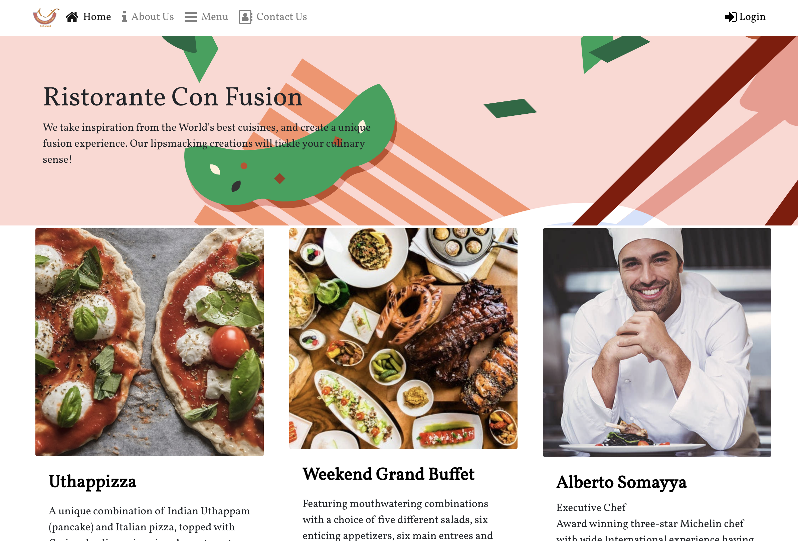
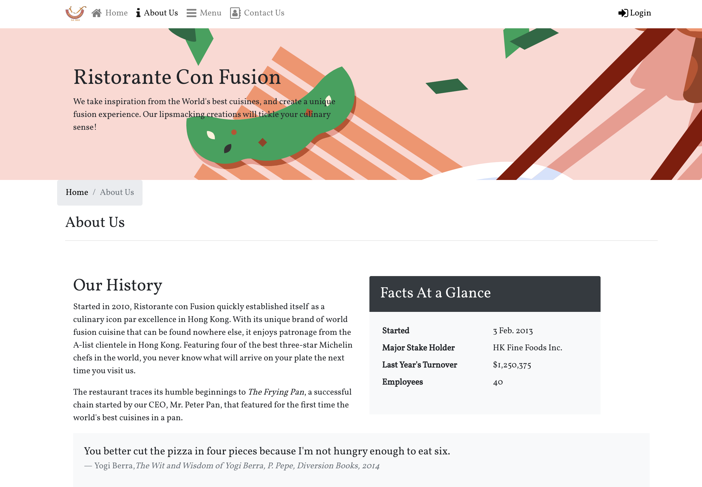

# Ristorante con Fusion
_A restaurant website design, utilizing React_

Check out the website [here](https://vanessaaleung.github.io/conFusion-react/)

## Features
### Carousel 
_with Javascript control to play/pause the slides_

### Badges
_to highlight new dishes/campaigns_

### Login Button

### Reserve Table
_Allow customers to reserve table with datetime,  and number of guests info_

### Feedback Form

### About Us Page

### Accordian 
_Display Corporate Leadership info_

### Social Media Buttons
_to share the website_

