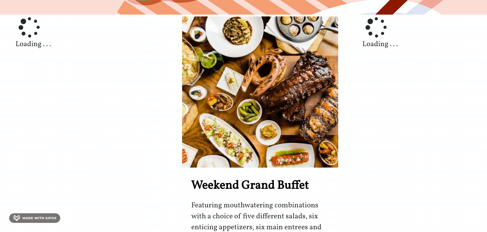
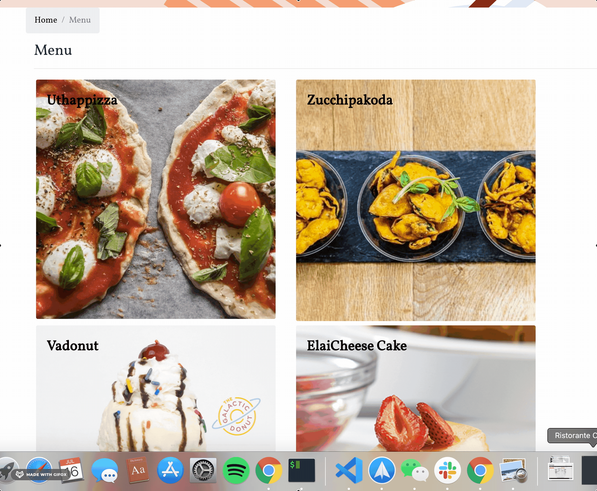
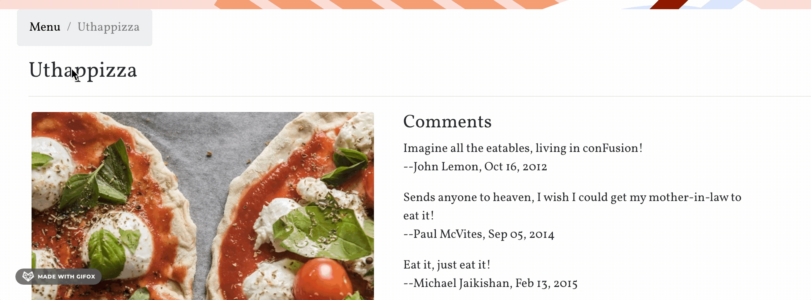
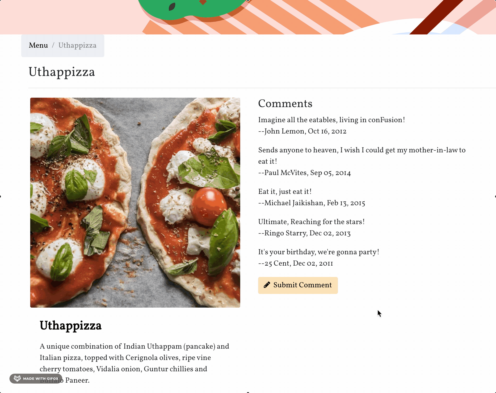
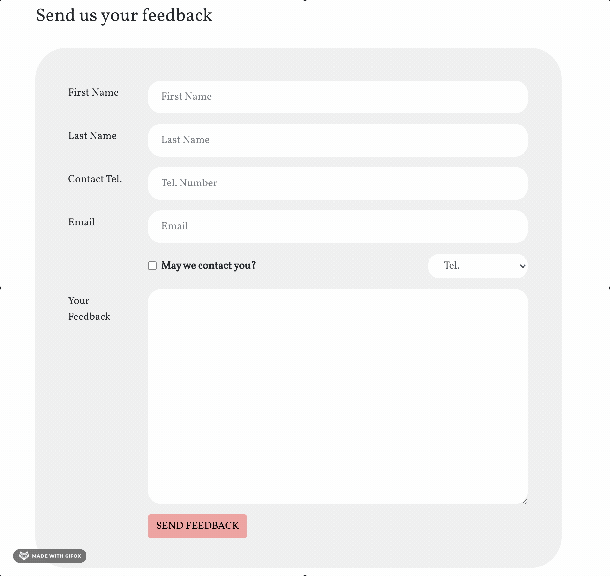
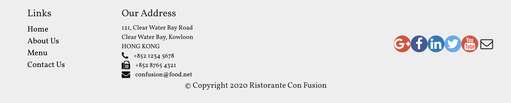

# Ristorante con Fusion
_A restaurant website design, utilizing React and Redux_

Check out the website [here](https://vanessaaleung.github.io/conFusion-react/)

## Features
### Login
_with uncontrolled form_

### Asynchronous Communication
_Design to recognize the asynchronous nature of communication with Redux Thunk_

### Dish Detail page

### Breadcrumb Navigation

### Submit Comments
_with React-Redux-Form_

### Feedback Form
_with React-Redux-Form_

### About Us Page

### Social Media Buttons
_to share the website_

